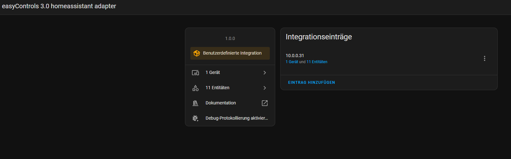
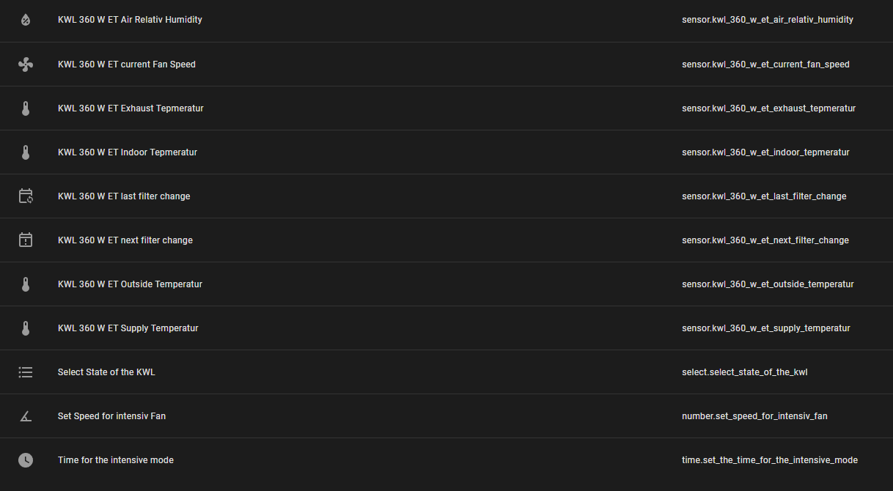
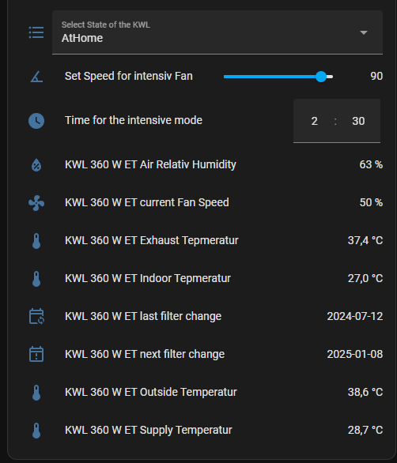

# easyControls 3.0 to homeassistant for Home Assistant

Big thank you at sanchosk for his initial work (https://github.com/sanchosk/helios2mqtt)

## Installation
Via HACS custom repo (not tested at the moment), or copy the folder EasyControls3_homeassistant directly into your custom_components directory (if not available, create one under our conf directory)

The integration could be set up completely from UI. After the repo is under custom_components the integration should be found via EasyControls3_homeassistant (sorry for the name)

It only needs the ip address (e.g. 10.0.0.42) to find it

## Current state

**First release - only some testing - no great error handling**

Communication is working via WebSocket, so the integration should work with EasyControls 3.x version devices (only teste with one so far).

Supported Features:
- Sensors for temperature values (indoor, outside, supply, exhaust)
- Sensor for last time of filter change as well as one for the next change
- Sensor for current fan speed
- Sensor for relative humidity
- Time entity to set the Intensive mode duration (it also shows the current set value)
- Number entity to set the Intensive Fan speed (it also shows the current set value)
- Select entity to change the KWL Mode (it also shows the current set value)

The integration uses the serial number of the device to assign uniq ids to the sensors.

Tested with a KWL 360

## Pictures
### Integration overview

### Entities overview

### Possible UI

